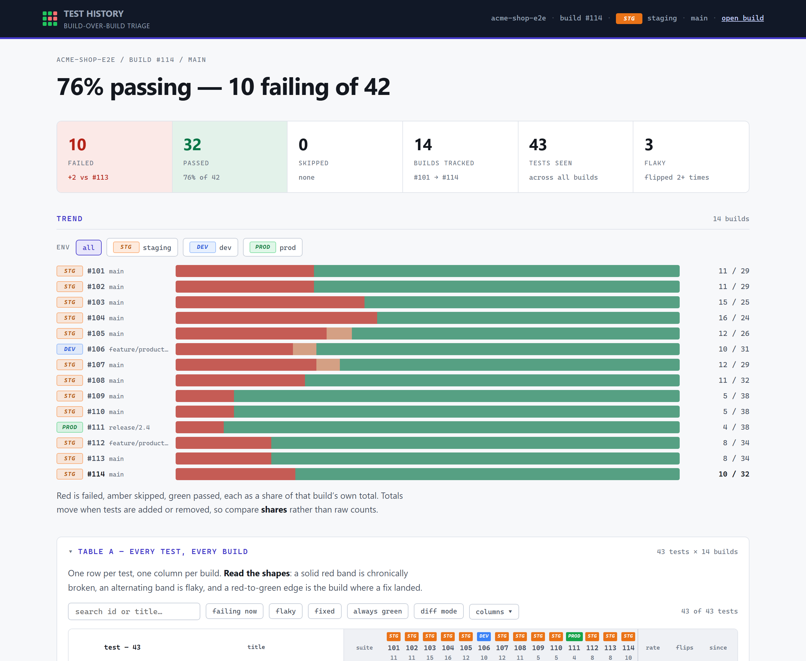
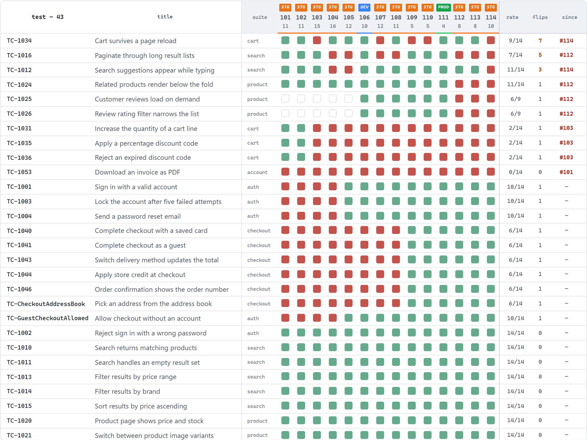
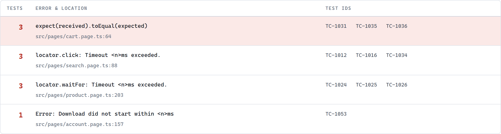

# Playwright Test Triage

**Cross-build test history and failure-cause triage for Playwright suites running in CI.**

Every per-build test report dies with the build that produced it. This one
doesn't — and it answers the question a wall of red tests never does: *how many
problems is this, actually?*

[](test/)
[](package.json)
[](package.json)
[](LICENSE)

### Live demo

**[Open the demo report →](https://parthicm.github.io/playwright-test-triage/demo/report.html)**
— fourteen builds of a fictional e-commerce suite. Search it, filter it, click around.

**[Project walkthrough →](https://parthicm.github.io/playwright-test-triage/demo/index.html)**
— the problem, the architecture, and the design decisions behind it.

<sub>Both pages are fully interactive. GitHub does not render HTML files from the
repository view, so the links above point at GitHub Pages. To run them locally
instead: `npm run demo`, then open `demo/report.html` in a browser.</sub>



---

## The problem

Jenkins rotates build records. Playwright's HTML report, Allure and JUnit each
show exactly **one build**. So the questions a team actually asks —

- *Has `TC-1042` ever passed, or has it been red since the day it was written?*
- *Did my fix work, or did that run just get lucky?*
- *Are these 26 failures 26 problems, or 4?*

— all need evidence that has already been deleted by the time anyone looks.

And even with one build in front of you, forty red tests tell you nothing about
the size of the job. One broken selector or fifteen unrelated regressions look
identical in a standard report.

## What it does

A post-test step reads the JUnit XML your suite already produces, appends it to
a store **outside the build record**, and renders one self-contained HTML page.

### Table A — every test, every build



One row per test, one column per build. **Read the shapes**: a solid red band is
chronically broken, an alternating band is flaky, a red-to-green edge is the
build where a fix landed. Dashed cells mean the test did not exist yet — because
a test that was *absent* is not a test that *passed*, and conflating those is
how a report quietly lies about coverage.

`rate`, `flips` and `since` summarise each row. **2+ flips is the working
definition of flaky**; `since #103` tells you exactly where in the commit
history to look.

### Table B — root causes



Failing tests grouped by **failure signature** — the error message plus the
deepest frame in *your* code. Ten red tests, four things to fix. Earlier in the
same history, sixteen failures collapse to five causes and the top row alone
clears six tests.

**Fixing one row clears every test in it.**

### Environment awareness

A suite that ran against staging on Monday and production on Tuesday produces
two builds whose failures are not comparable. Every build carries an
environment chip, and both the trend and the matrix can be filtered to one
environment so you don't draw a conclusion across that boundary.

The chips carry a colour *and* a label — colour alone doesn't survive a
greyscale print, a compressed screenshot, or the ~8% of men who can't separate
orange from green.

---

## Quick start

No install, no dependencies. Node 18+.

```bash
git clone https://github.com/ParthiCM/playwright-test-triage.git
cd playwright-test-triage

npm run demo        # generate 14 builds of mock history and render the report
open demo/report.html
```

Against a real suite:

```bash
node src/triage-report.js --init \
  --junit playwright-report/results.xml \
  --build 1 \
  --store /somewhere/durable/triage/my-suite \
  --out triage-report/index.html
```

Then drop `--init` and wire it into CI — **[Jenkins setup guide](docs/jenkins-setup.md)**.

### Options

| Flag | Required | Purpose |
|---|---|---|
| `--store <dir>` | yes | Per-build JSON files. Must live outside the CI workspace. |
| `--out <file>` | yes | Where to write the HTML. |
| `--junit <file>` | no | JUnit XML to record. Omit to re-render existing history. |
| `--build <n>` | no | Build number. Required with `--junit`. |
| `--branch <name>` | no | Shown in the trend. |
| `--env <url\|name>` | no | Environment. A URL is fine — normalised to dev/staging/prod. |
| `--url <url>` | no | Link back to the CI build. |
| `--job <name>` | no | Name shown in the page header. |
| `--src-root <dir>` | no | Your own code's top directory, for stack-frame grouping. Default `src`. |
| `--init` | no | **First run only.** Creates the store. |

---

## How it works

```
Playwright run
  │  writes   playwright-report/results.xml      (JUnit — already produced today)
  ▼
triage-report.js                                 (a post-test shell step)
  │  appends  <store>/build-0142.json            OUTSIDE the workspace
  │  reads    <store>/build-*.json               the full history
  ▼
triage-report/index.html                         one self-contained page
```

Four decisions carry the design:

**The store lives outside the build record.** Build rotation and workspace
cleanup can't touch it. Build #142's data is captured at #142 and survives long
after Jenkins forgets #142 existed.

**One immutable file per build.** Not a growing database. A build only ever
writes its own file — which makes the whole thing crash-safe, idempotent and
concurrency-safe without a line of locking code. ~12 KB per build.

**Read the JUnit file, not the CI API.** An API-driven reporter can only see
what the server still remembers, which puts you back where you started.

**Zero dependencies.** The consumer is a shell step on a build agent someone
else administers. Every dependency is a thing that can fail to install.

Full reasoning, including the trade-offs: **[docs/architecture.md](docs/architecture.md)**.

---

## Repository layout

```
src/
  triage-report.js          CLI
  lib/junit.js              JUnit XML → results
  lib/signature.js          failure text → signature → clusters
  lib/store.js              immutable store + history matrix
  lib/env.js                URL → environment
  template/                 the report UI
test/                       43 unit tests, node:test, no runner needed
tools/
  generate-mock-history.js  fabricates a demo history
jenkins/
  execute-shell.sh          the build step, commented
  freestyle-config.xml      a complete job
  Jenkinsfile               Pipeline equivalent
  docker-compose.yml        local Jenkins to try it against
docs/
  architecture.md           why it is built this way
  jenkins-setup.md          step by step
  report-guide.md           how to read the report
  troubleshooting.md        every failure that has actually happened
demo/
  report.html               the live demo
  index.html                project walkthrough
```

## Tests

```bash
npm test
```

43 tests, `node:test`, no test framework to install. They pin down the things
that are genuinely easy to get wrong:

- A describe block named `Suite TC_2` must not hijack the id of every test
  inside it.
- A retried test keeps its **worst** outcome, not its final one.
- Signature extraction reads `<failure>`, **never** `<system-out>` — see below.
- A test absent from a build is not a test that passed.
- Re-running build #142 replaces #142 and nothing else.
- One corrupt JSON file doesn't take the whole report down.

## The bug worth knowing about

An early version read the first CDATA block anywhere inside `<testcase>`. On any
suite that logs to stdout, that is `<system-out>` — so every signature picked up
a unique timestamp, every group had exactly one member, and the cause table
degenerated into one row per test.

It looked like it was working. It was worse than useless, because it *appeared*
to be triaging while telling you nothing.

The fix is three lines; the lesson is that a reporting bug which produces
plausible output is far more dangerous than one that crashes. That is most of
why `test/signature.test.js` exists, and why the report states in the report
that its grouping is mechanical rather than diagnostic.

## Mock data

Everything in the demo is fabricated — a fictional "Acme Shop" suite, fictional
hostnames, a scripted narrative of defects appearing and being fixed.

The generator does **not** write store files directly. It emits real JUnit XML
(including the `<system-out>` logging that makes parsing non-trivial) and feeds
it through the same parser and store writer the production path uses. If the
parser breaks, the demo breaks.

```bash
node tools/generate-mock-history.js --out .mock-store --builds 14
```

Output is deterministic, so a committed demo report doesn't churn.

## Limitations

- **Not a flake-quarantine system.** It shows you what's flaky; what to do
  about it is a human call.
- **It doesn't know why anything failed.** It groups; it doesn't diagnose. Two
  different bugs producing the same timeout in the same helper will group
  together.
- **Doesn't replace a per-build report.** Playwright's HTML report has traces,
  screenshots and video. This answers the question that spans builds, and links
  back to the build for the rest.
- **Regex-based XML reading.** A deliberate trade for zero dependencies,
  acceptable only because the input shape is narrow and every assumption is
  pinned by a test.

## Licence

MIT © Parthiban Murugan
